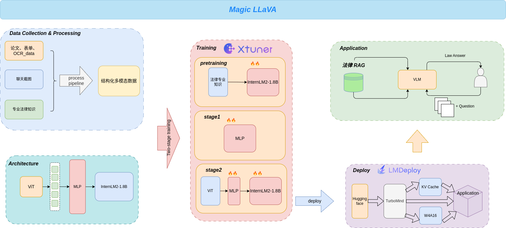

# Magic_LlaVA - 法律证据提取与总结多模态大模型


## 📖 目录

- [Magic_LlaVA - 法律证据提取与总结多模态大模型](#Magic_LlaVA - 法律证据提取与总结多模态大模型)
  - [📄 架构图](#-架构图)
  - [🎉 News](#-News)
  - [📝 简介](#-简介)
  - [📌 快速开始](#-快速开始)
    - [1. 算力要求](#1-算力要求)
    - [2. 基于 transformers 使用模型](#2-基于-transformers-使用模型)
    - [3. 基于 LMDeploy 高性能部署](#3-基于-lmdeploy-高性能部署)
  - [📒 数据构建](#-数据构建)
  - [🔧 训练指南](#-训练指南)
  - [📚 应用体验](#-应用体验)
  - [🎖️ 致谢](#%EF%B8%8F-致谢)
  - [开源许可证](#开源许可证)


## 📄 架构图

<div align="center">
  
</div>


## 🎉 News


## 📝 简介

**Magic_LLaVA** 是一个在经典 LLaVA 架构上进行改进并训练，旨在从多张聊天截图中提取法律事实作为法律凭证，以此来回答用户提出的各种法律问题的多模态大模型。同时，应用支持 RAG 检索法律知识以进行专业的知识补充，让其更精准地回答用户的问题。

Magic_LLaVA 经过了大量 OCR-text、文档、表单数据集的训练，在有关文档识别的能力上有了大幅的提升，同时，我们使用了代码、数学数据集增强模型的推理能力，并在法律专业知识数据集上进行继续预训练使模型获得了法律相关知识。

**如果你觉得本项目有帮助的话，欢迎star～⭐**


## 📌 快速开始

### 1. 算力要求

- 使用模型进行推理至少需要8G显存


### 2. 基于 transformers 使用模型

```python
from transformers import LlavaNextProcessor, LlavaNextForConditionalGeneration
import torch
from PIL import Image
import requests

processor = LlavaNextProcessor.from_pretrained("magic_llava")

model = LlavaNextForConditionalGeneration.from_pretrained("magic_llava", torch_dtype=torch.float16, low_cpu_mem_usage=True) 
model.to("cuda:0")

url = "https://github.com/haotian-liu/LLaVA/blob/1a91fc274d7c35a9b50b3cb29c4247ae5837ce39/images/llava_v1_5_radar.jpg?raw=true"
image = Image.open(requests.get(url, stream=True).raw)
prompt = "[INST] <image>\nWhat is shown in this image? [/INST]"

inputs = processor(prompt, image, return_tensors="pt").to("cuda:0")

output = model.generate(**inputs, max_new_tokens=100)

print(processor.decode(output[0], skip_special_tokens=True))

```


### 3. 基于 lmdeploy 高性能部署

```shell
# 使用命令行
lmdeploy serve api_server /root/model/magic_llava  --model-name internvl-internlm2 --server-port 23333
```


## 📒 数据构建

- 详情请见[数据构建](./datasets/README.md)


## 🔧 训练指南

- 详情请见[训练指南](./train/README.md)


## 📚 应用体验

- 应用部署在 [OpenXLab 应用中心](https://openxlab.org.cn/apps/detail/Nobody-ML/Magic_LLaVA)，可前往体验


## 🎖️ 致谢

- [OpenXLab](https://openxlab.org.cn/home)
- [InternLM](https://github.com/InternLM/InternLM/tree/main)

## 开源许可证

该项目采用 [AGPL-3.0 license开源许可证](LICENSE)。同时，请遵守所使用的模型与数据集的许可证。
